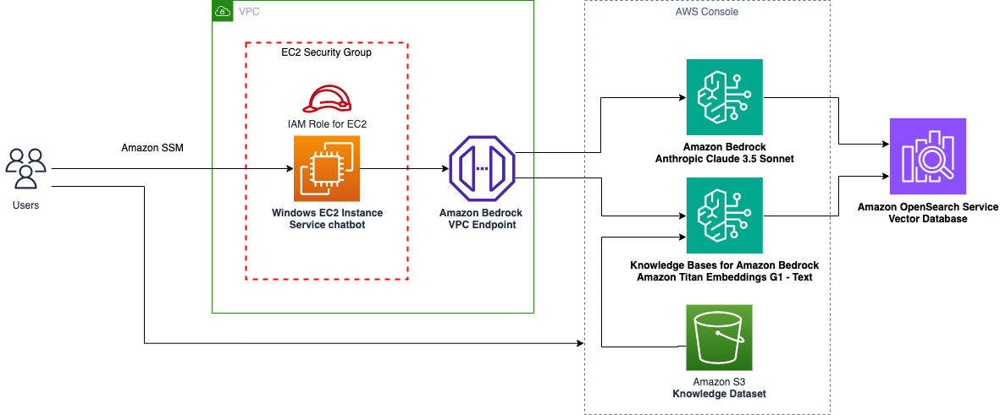
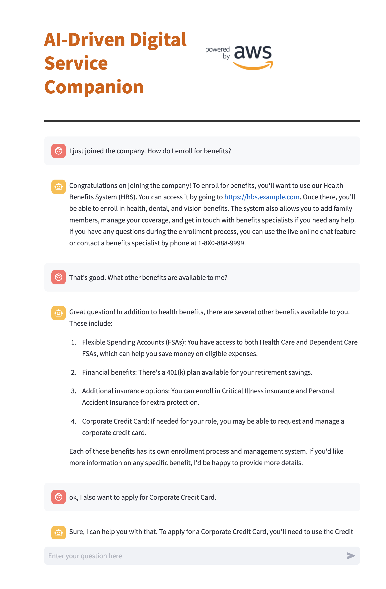

# Build an AI-Powered Digital Service Companion with Amazon Bedrock


The AI-Powered Digital Service Companion is a generative AI-based service catalog chatbot. Governments often create "service catalogs" - websites or applications that list all the products and services they offer, including IT support, IT operations, HR, facilities, and more. Employees and customers can search the catalog and submit requests or get information. However, it can be time-consuming to search through the entire catalog to find the right service, especially if you're unsure of the specific service needed to accomplish a task.

AI-powered chatbots can simplify this process by understanding requests in natural language and providing direct answers. For example, if you ask "How do I apply for a corporate credit card?", the chatbot can give you the right information quickly, saving you time.

This repository contains the code samples that will let you explore how to use the [Retrieval Augmented Generation (RAG)](https://docs.aws.amazon.com/sagemaker/latest/dg/jumpstart-foundation-models-customize-rag.html) architecture with [Amazon Bedrock](https://aws.amazon.com/bedrock/) and [Amazon OpenSearch Serverless (AOSS)](https://aws.amazon.com/opensearch-service/features/serverless/) to quickly build a secure service catalog chatbot.

This repository provides a code samples that should be used in your demonstration environment only.

## Archtiecture 


## Prerequisites

For this walkthrough, complete the following prerequisites using the best practice in [AWS Well-Architected Framework - Security Pillar](https://docs.aws.amazon.com/wellarchitected/latest/security-pillar/welcome.html).

1. You must have a valid [AWS account and a VPC](https://docs.aws.amazon.com/vpc/latest/userguide/vpc-getting-started.html). It is also recommended to implement AWS monitoring and logging for your AWS account using Amazon CloudWatch and AWS CloudTrail services.

2. You must have an AWS Identity and Access Management (IAM) role in the account that has sufficient permissions to create the necessary resources. You must use least-privilege policies to provide access to Amazon Bedrock, Amazon OpenSearch Serveless and Amazon S3 services.

3. Configure interface [VPC endpoints](https://docs.aws.amazon.com/bedrock/latest/userguide/vpc-interface-endpoints.html) to create a private connection between your VPC and Amazon Bedrock.

4. Configure a security group for EC2 to allow outbound access to Amazon Bedrock endpoints only.

5. Configure an IAM role for EC2 instance using least-privilege principle to allow access Amazon Bedrock runtime and agent runtime API's.

Here is an example of IAM policy to provide access to Amazon Bedrock APIs.
```
{
    "Version": "2012-10-17",
    "Statement": [
        {
            "Sid": "InvokeAnthropicClaudeModel",
            "Effect": "Allow",
            "Action": [
                "bedrock:InvokeModel"
            ],
            "Resource": "arn:aws:bedrock:AWS_REGION::foundation-model/anthropic.claude-3-5-sonnet-20240620-v1:0"
        },
        {
            "Sid": "RetrieveTextUsingKBforBedrock",
            "Effect": "Allow",
            "Action": [
                "bedrock:Retrieve"
            ],
            "Resource": [
                "arn:aws:bedrock:AWS_REGION:111122223333:knowledge-base/KB12345678"
            ]
        }
    ]
}
```

6. Launch a [Windows EC2 instance](https://docs.aws.amazon.com/AWSEC2/latest/UserGuide/EC2_GetStarted.html) by leverging the security group and IAM role from previous steps. Install [Python 3.9](https://www.python.org/downloads/windows/) or later version on the EC2 instance.

7. [Request access](https://docs.aws.amazon.com/bedrock/latest/userguide/model-access-modify.html) to foundation models in Amazon Bedrock. In this walkthrough, we will use "Amazon Titan Embeddings G1 - Text " for text embeddings and "Anthropic Claude 3.5 Sonnet" for text generation.

## Dependencies and Installation

Use the following steps to configure the environment:

1. Create an Amazon S3 bucket.(https://docs.aws.amazon.com/AmazonS3/latest/userguide/creating-bucket.html)

2. Upload your own service catalog knowledge dataset to S3 bucket or use the one provided in this repository (service-catalog-dataset.csv).

3. Set up an Amazon Bedrock knowledge base using your Amazon S3 bucket as the data source, and an Amazon OpenSearch Serverless vector search collection as a vector store.(https://docs.aws.amazon.com/bedrock/latest/userguide/knowledge-base-create.html)

   After setting up, make a note of Knowledge Base ID.

4. Connect to EC2 instance using [Fleet Manager Reote Desktop](https://docs.aws.amazon.com/systems-manager/latest/userguide/fleet-manager-remote-desktop-connections.html)

5. Create a new python virtual environment and activate it.(https://docs.python.org/3/library/venv.html#module-venv)

```
python3.9 -m venv env
source env/bin/activate
```
6. Clone the GitHub repository to your local machine.

```
git clone https://gitlab.aws.dev/reinvent2024-service-catalog.git
cd reinvent2024-service-catalog
```

7. Install the required dependencies using the provided requirements.txt file.

```
pip install -r requirements.txt
```

8. Configure the necessary environment variables (AWS_REGION, BEDROCK_KNOWLEDGE_BASES_ID - use the values from step 3).

```
AWS_REGION=us-east-1
BEDROCK_KNOWLEDGE_BASES_ID=XYSHBJL7TG
```

## Usage

To run the service catalog chatbot, use the following command:

<!-- -->
`streamlit run service_catalog_app.py --server.port 8080`

This will launch the service catalog chatbot application, which you can access in your browser at http://localhost:8080. The service catalog interface should display, as shown in the example screenshot. The configuration to open port 8080 is for demonstration only. 

For adopting this code to your production environment, you must use [AWS Well-Architected](https://aws.amazon.com/architecture/well-architected/) best practices including authentication, authorization and applicaiton-level logging. 

